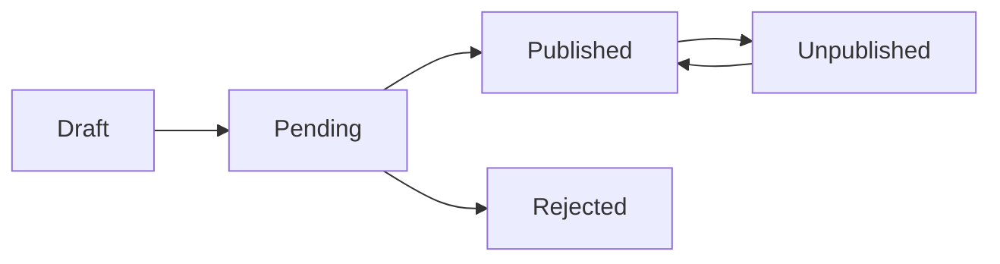

# GolpoKotha

[](https://nextjs.org/)
[](https://react.dev/)
[](https://expressjs.com/)
[](https://www.mongodb.com/)
[](https://www.typescriptlang.org/)

GolpoKotha is a full-stack blog publishing platform with email-verified registration, role-based dashboards, blog moderation, reader engagement, notifications, analytics, and password recovery.

## Table of Contents

- [Overview](#overview)
- [Features](#features)
- [RBAC Matrix](#rbac-matrix)
- [Tech Stack](#tech-stack)
- [Repository Structure](#repository-structure)
- [Core Workflows](#core-workflows)
- [API Reference](#api-reference)
- [Database Models](#database-models)
- [Local Setup](#local-setup)
- [Environment Variables](#environment-variables)
- [Visuals](#visuals)
- [Roadmap](#roadmap)
- [Implementation Notes](#implementation-notes)

## Overview

GolpoKotha provides separate experiences for:

- Administrators managing users, content, taxonomy, and moderation
- Authors creating, submitting, and analyzing blog posts
- Readers discovering published content and maintaining engagement history

The frontend is built with Next.js and Redux Toolkit. The backend exposes an Express REST API backed by MongoDB through Mongoose.

## Features

### Authentication

- Login with JWT-based authentication
- HttpOnly access and refresh-token cookies
- Refresh-token rotation support
- Logout and session restoration
- Password change for authenticated users
- Forgot-password email flow
- Ten-minute password reset links
- Email-verified registration
- Six-digit registration OTPs
- OTP expiry and invalid-attempt limits
- Registration OTP resend

### Blog Publishing

- Create, update, submit, publish, reject, unpublish, and delete blogs
- Draft and pending workflows
- Featured and content image uploads
- Cloudinary image storage
- Public blog browsing
- Search, category, author, tag, sorting, pagination, and view tracking
- Soft deletion
- Blog analytics for authors

### Reader Engagement

- Blog likes and unlike actions
- Approved public comments
- Comment creation, editing, deletion, and moderation
- Reading history
- Blog view tracking
- Notifications with read state and pagination

### Administration

- User management
- User activation, deactivation, blocking, and deletion
- Category management
- Tag management
- Blog moderation
- Comment moderation
- Administrative dashboards and statistics

## RBAC Matrix

The backend uses the following persisted roles:

- `administration`
- `author`
- `user`

| Capability | Administration | Author | User |
|---|:---:|:---:|:---:|
| Authenticate and manage own profile | Yes | Yes | Yes |
| Change password | Yes | Yes | Yes |
| Browse published blogs | Yes | Yes | Yes |
| Like published blogs | Yes | Yes | Yes |
| Manage own comments | Yes | Yes | Yes |
| View own notifications | Yes | Yes | Yes |
| Manage reading history | Yes | Yes | Yes |
| Create blogs | Yes | Yes | No |
| Manage own blogs | Yes | Yes | No |
| Submit blogs | Yes | Yes | No |
| View author analytics | No | Yes | No |
| Review own-blog comments | No | Yes | No |
| View all blogs | Yes | No | No |
| Publish, reject, or unpublish blogs | Yes | No | No |
| Manage users | Yes | No | No |
| Manage categories | Yes | No | No |
| Manage tags | Yes | No | No |
| Moderate all comments | Yes | No | No |

The frontend also contains an `administrator` type, but the backend user schema accepts `administration`, `author`, and `user`.

## Tech Stack

| Area | Technologies |
|---|---|
| Frontend | Next.js `16.3.1`, React `19.2.8`, React DOM `19.2.8`, TypeScript |
| UI | Tailwind CSS `4`, Lucide React, React Toastify |
| State | Redux Toolkit, React Redux |
| Forms | React Hook Form, Yup |
| HTTP | Axios |
| Charts | Recharts |
| Backend | Node.js, Express `5.2.1` |
| Database | MongoDB, Mongoose `9.6.2` |
| Authentication | JSON Web Tokens, bcryptjs, HttpOnly cookies |
| Validation | Joi schemas, controller checks, Mongoose validation |
| Email | Nodemailer and Brevo SDK |
| Uploads | Multer and Cloudinary |
| Middleware and tooling | Helmet, CORS, Morgan, express-rate-limit, Nodemon |
| Templates | EJS |

## Repository Structure

```text
.
├── backend/
│   ├── app.js
│   ├── package.json
│   ├── app/
│   │   ├── config/
│   │   │   ├── cloudinary.js
│   │   │   ├── db.js
│   │   │   └── emailConfig.js
│   │   ├── controllers/
│   │   ├── middleware/
│   │   ├── models/
│   │   ├── routes/
│   │   ├── utils/
│   │   └── validations/
│   ├── public/
│   └── uploads/
│
├── frontend/
│   ├── app/
│   │   ├── (auth)/
│   │   │   ├── forgot-password/
│   │   │   ├── login/
│   │   │   ├── register/
│   │   │   ├── reset-password/
│   │   │   └── verifyOtp/
│   │   ├── (dashboard)/
│   │   │   └── dashboard/
│   │   │       ├── administration/
│   │   │       ├── author/
│   │   │       └── reader/
│   │   ├── (public)/
│   │   ├── globals.css
│   │   ├── layout.tsx
│   │   └── page.tsx
│   ├── api/
│   │   ├── axios/
│   │   └── endPoints/
│   ├── components/
│   │   ├── administration/
│   │   ├── auth/
│   │   ├── author/
│   │   ├── blog/
│   │   ├── comments/
│   │   ├── common/
│   │   ├── layout/
│   │   ├── profile/
│   │   ├── public/
│   │   └── reader/
│   ├── redux/
│   │   ├── hooks.ts
│   │   ├── provider/
│   │   ├── slice/
│   │   └── store/
│   ├── types/
│   ├── utils/
│   ├── next.config.ts
│   ├── proxy.ts
│   └── package.json
│
└── README.md
```

## Core Workflows

### Authentication and Cookies

1. A user submits login credentials to `POST /auth/login`.
2. The backend validates the account and credentials.
3. JWT access and refresh tokens are issued.
4. Tokens are stored in secure HttpOnly cookies.
5. Authenticated requests use the `accessToken` cookie.
6. The frontend can request `POST /auth/refresh-token` when the access token expires.
7. Logout clears the refresh-token cookie and stored session token.

### Registration and OTP Verification

1. Registration data is submitted to `POST /auth/send-registration-otp`.
2. The backend checks whether the email already belongs to a user.
3. The password is hashed for temporary registration storage.
4. A six-digit OTP is generated and hashed.
5. The OTP record expires after ten minutes.
6. The OTP is sent by email.
7. `POST /auth/resend-registration-otp` replaces the OTP and resets attempts.
8. `POST /auth/verify-registration-otp` verifies the code.
9. A verified user account is created after successful verification.

Invalid OTP attempts are tracked, and the record is removed after five invalid attempts.

### Password Reset

1. A user submits an email through `POST /auth/forgot-password`.
2. The backend finds the matching user.
3. A JWT reset token is signed using `user._id + JWT_SECRET`.
4. The token expires after ten minutes.
5. A reset link is emailed in this format:

   ```text
   /reset-password?token=<token>&id=<user-id>
   ```

6. The frontend reads `token` and `id` from the query string.
7. The new password and confirmation are submitted to `POST /auth/reset-password`.
8. The backend verifies the token, hashes the new password, clears the stored refresh token, and saves the user.
9. The frontend redirects the user to `/login`.

### Blog Lifecycle



Typical workflow:

1. An author creates a blog as a draft.
2. The author submits the draft.
3. The blog becomes pending.
4. Administration publishes or rejects the blog.
5. Published blogs become visible to readers.
6. Administration can unpublish published blogs.
7. Unpublished blogs can be published again.
8. Blog deletion is implemented as soft deletion.

## API Reference

All API paths are relative to the backend origin.

### Authentication

| Method | Endpoint | Access |
|---|---|---|
| `POST` | `/auth/forgot-password` | Public |
| `POST` | `/auth/reset-password` | Public |
| `POST` | `/auth/send-registration-otp` | Public |
| `POST` | `/auth/resend-registration-otp` | Public |
| `POST` | `/auth/verify-registration-otp` | Public |
| `POST` | `/auth/login` | Public |
| `POST` | `/auth/refresh-token` | Public, refresh cookie |
| `GET` | `/auth/me` | Authenticated |
| `POST` | `/auth/logout` | Authenticated |
| `PATCH` | `/auth/change-password` | Authenticated |

### Blogs

| Method | Endpoint | Access |
|---|---|---|
| `GET` | `/blog` | Public |
| `GET` | `/blog/:id` | Public, optional authentication |
| `POST` | `/blog/:id/view` | Public, optional authentication |
| `GET` | `/blog/my-blogs` | Author, administration |
| `POST` | `/blog/create` | Author, administration |
| `PATCH` | `/blog/:id/update` | Author owner, administration |
| `PATCH` | `/blog/:id/submit` | Author owner, administration |
| `GET` | `/blog/administration/all` | Administration |
| `PATCH` | `/blog/:id/publish` | Administration |
| `PATCH` | `/blog/:id/reject` | Administration |
| `PATCH` | `/blog/:id/unpublish` | Administration |
| `DELETE` | `/blog/:id/delete` | Author owner, administration |

Supported public blog query parameters include `search`, `category`, `author`, `tag`, `sort`, `page`, and `limit`. Supported sort values are `latest`, `oldest`, and `mostViewed`.

### Categories

| Method | Endpoint | Access |
|---|---|---|
| `GET` | `/category` | Public |
| `GET` | `/category/:id` | Public |
| `POST` | `/category/create` | Administration |
| `PATCH` | `/category/:id/update` | Administration |
| `PATCH` | `/category/:id/activate` | Administration |
| `PATCH` | `/category/:id/deactivate` | Administration |
| `DELETE` | `/category/:id/delete` | Administration |

### Tags

| Method | Endpoint | Access |
|---|---|---|
| `GET` | `/tag` | Public |
| `GET` | `/tag/:id` | Public |
| `GET` | `/tag/admin/all` | Administration |
| `POST` | `/tag` | Administration |
| `PATCH` | `/tag/:id` | Administration |
| `PATCH` | `/tag/:id/activate` | Administration |
| `PATCH` | `/tag/:id/deactivate` | Administration |
| `DELETE` | `/tag/:id` | Administration |

### Comments

| Method | Endpoint | Access |
|---|---|---|
| `GET` | `/comment/blog/:blogId` | Public, approved comments |
| `POST` | `/comment/blog/:blogId/create` | Authenticated |
| `GET` | `/comment/author` | Author |
| `GET` | `/comment/administration` | Administration |
| `PATCH` | `/comment/:id/update` | Authenticated owner |
| `DELETE` | `/comment/:id/delete` | Authenticated owner |
| `PATCH` | `/comment/:id/moderate` | Administration |

Comment moderation supports `approved`, `rejected`, and `hidden`.

### Likes

| Method | Endpoint | Access |
|---|---|---|
| `GET` | `/like/:blogId/like-count` | Public |
| `GET` | `/like/:blogId/status` | Authenticated |
| `POST` | `/like/:blogId/like` | Authenticated |
| `DELETE` | `/like/:blogId/unlike` | Authenticated |

### Notifications

| Method | Endpoint | Access |
|---|---|---|
| `GET` | `/notification` | Authenticated |
| `PATCH` | `/notification/read-all` | Authenticated |
| `PATCH` | `/notification/:id/read` | Authenticated recipient |
| `DELETE` | `/notification/:id/delete` | Authenticated recipient |

### Reading History

| Method | Endpoint | Access |
|---|---|---|
| `POST` | `/readingHistory/:blogId` | Authenticated |
| `GET` | `/readingHistory` | Authenticated |
| `DELETE` | `/readingHistory` | Authenticated |

### Users and Profiles

| Method | Endpoint | Access |
|---|---|---|
| `GET` | `/user/profile` | Authenticated |
| `PATCH` | `/user/profile/update` | Authenticated |
| `GET` | `/user/all-user` | Administration |
| `GET` | `/user/:id` | Administration |
| `PATCH` | `/user/:id/update` | Administration |
| `PATCH` | `/user/:id/activate` | Administration |
| `PATCH` | `/user/:id/deactivate` | Administration |
| `PATCH` | `/user/:id/block` | Administration |
| `DELETE` | `/user/:id/delete` | Administration |

### Analytics

| Method | Endpoint | Access |
|---|---|---|
| `GET` | `/analytics/author` | Author |

Supported analytics ranges are `7d`, `30d`, `90d`, and `all`.

## Database Models

| Model | Purpose |
|---|---|
| `User` | Accounts, roles, password hashes, status, profile data, verification state, refresh tokens |
| `Blog` | Blog content, authorship, taxonomy, status, images, views, publication metadata, deletion state |
| `Category` | Blog categories, slugs, descriptions, images, active and deletion state |
| `Tag` | Tags, slugs, active and deletion state |
| `Comment` | Blog comments, authorship, moderation state, and moderator metadata |
| `Like` | User/blog likes with a unique compound index |
| `Notification` | Recipient notifications, references, messages, read state, and notification type |
| `ReadingHistory` | User/blog reading records with repeat-visit timestamps |
| `BlogView` | Blog view records with optional user association |
| `Otp` | Hashed OTPs, expiry, purpose, temporary registration data, and attempt count |

MongoDB connectivity is configured through `MONGODB_URL`.

## Local Setup

### Prerequisites

- Node.js and npm
- MongoDB connection
- SMTP or Brevo email configuration
- Cloudinary credentials for image uploads

### Backend

```bash
cd backend
npm install
npm run dev
```

The production-style command is:

```bash
npm start
```

The backend defaults to port `4000`.

### Frontend

```bash
cd frontend
npm install
npm run dev
```

The frontend defaults to port `3000`.

Additional frontend commands:

```bash
npm run build
npm start
npm run lint
```

## Environment Variables

Use placeholders for all credentials and secrets.

### Backend `.env`

```env
PORT=4000
NODE_ENV=development

MONGODB_URL=<your-mongodb-connection-string>

ACCESS_TOKEN_SECRET=<your-access-token-secret>
ACCESS_TOKEN_EXPIRES_IN=30s

REFRESH_TOKEN_SECRET=<your-refresh-token-secret>
REFRESH_TOKEN_EXPIRES_IN=7d

JWT_SECRET=<your-password-reset-jwt-secret>

FRONTEND_URL=http://localhost:3000

CLOUDINARY_CLOUD_NAME=<your-cloudinary-cloud-name>
CLOUDINARY_API_KEY=<your-cloudinary-api-key>
CLOUDINARY_API_SECRET=<your-cloudinary-api-secret>

EMAIL_HOST=<your-smtp-host>
EMAIL_PORT=587
EMAIL_USER=<your-smtp-user>
EMAIL_PASS=<your-smtp-password>
EMAIL_FROM=<your-sender-email>

BREVO_API_KEY=<your-brevo-api-key>
```

### Render Backend Variables

Configure the same backend variables in the Render service environment:

```env
PORT=<render-assigned-port>
NODE_ENV=production

MONGODB_URL=<your-mongodb-connection-string>

ACCESS_TOKEN_SECRET=<your-access-token-secret>
ACCESS_TOKEN_EXPIRES_IN=<access-token-expiry>

REFRESH_TOKEN_SECRET=<your-refresh-token-secret>
REFRESH_TOKEN_EXPIRES_IN=<refresh-token-expiry>

JWT_SECRET=<your-password-reset-jwt-secret>

FRONTEND_URL=<your-vercel-frontend-url>

CLOUDINARY_CLOUD_NAME=<your-cloudinary-cloud-name>
CLOUDINARY_API_KEY=<your-cloudinary-api-key>
CLOUDINARY_API_SECRET=<your-cloudinary-api-secret>

EMAIL_HOST=<your-smtp-host>
EMAIL_PORT=<your-smtp-port>
EMAIL_USER=<your-smtp-user>
EMAIL_PASS=<your-smtp-password>
EMAIL_FROM=<your-sender-email>

BREVO_API_KEY=<your-brevo-api-key>
```

### Frontend `.env.local`

```env
NEXT_PUBLIC_API_BASE_URL=http://localhost:4000
```

### Vercel Frontend Variables

```env
NEXT_PUBLIC_API_BASE_URL=<your-render-backend-url>
```

The frontend Axios client uses `NEXT_PUBLIC_API_BASE_URL`. If it is not provided, the implementation falls back to the configured deployed API URL.

## Visuals

<!-- Add screenshot here: Login and registration experience -->

<!-- Add screenshot here: Reader blog discovery page -->

<!-- Add screenshot here: Author dashboard -->

<!-- Add screenshot here: Administration dashboard -->

<!-- Add screenshot here: Blog editor and moderation workflow -->

## Roadmap

No additional roadmap is defined in the current implementation.

<!-- Add future roadmap items here only when they are implemented or formally planned. -->

## Implementation Notes

- Access and refresh tokens are stored in secure HttpOnly cookies.
- The backend authentication middleware reads the `accessToken` cookie.
- Password reset tokens expire after ten minutes.
- Password reset clears the stored user refresh token.
- Registration OTP records use a MongoDB TTL index.
- Registration OTP attempts are limited to five invalid attempts.
- Blog image uploads use Multer memory storage and Cloudinary.
- Featured images accept one image upload.
- Content images accept up to ten image uploads.
- Uploaded files are limited to five megabytes and must use image MIME types.
- Frontend authentication routes are included in the proxy matcher.
- The proxy currently forwards requests with `NextResponse.next()` and does not implement server-side authorization.
