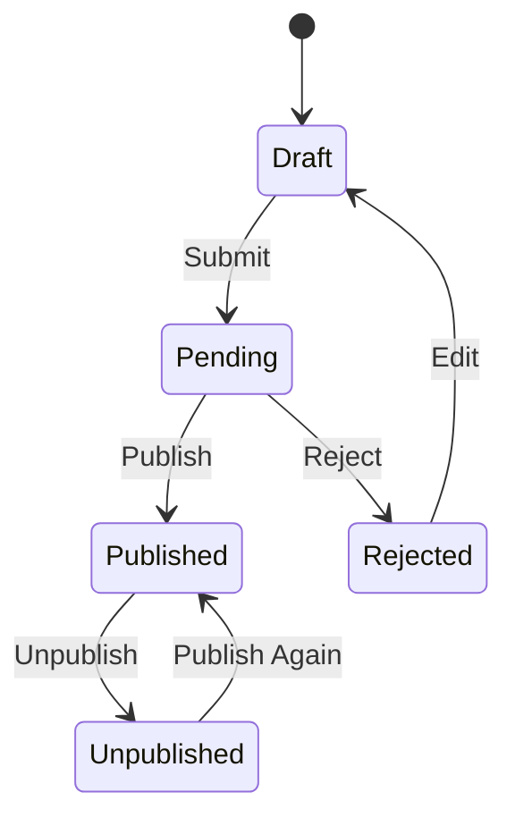
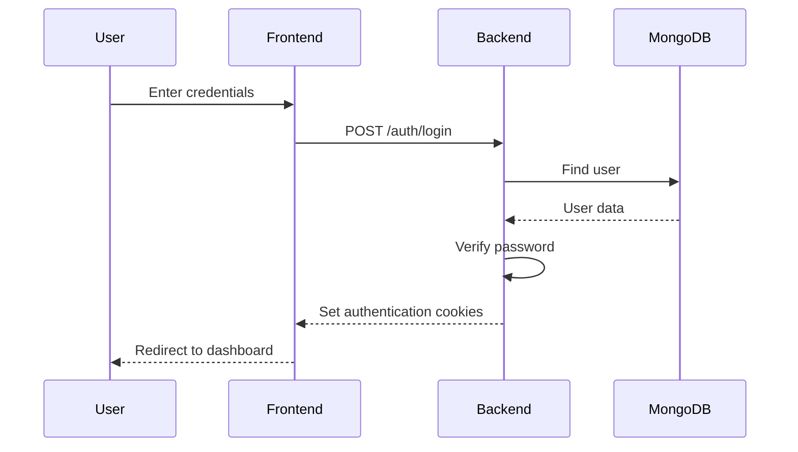
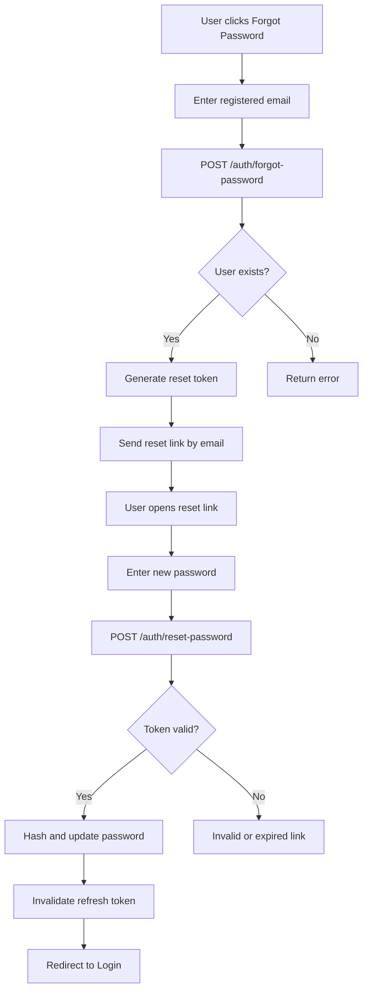

# ✍️ GolpoKotha

<div align="center">

### **A Modern Full-Stack Blog Publishing & Content Management Platform**

*Create. Publish. Discover. Engage.*

<br/>

[](https://nextjs.org/)
[](https://react.dev/)
[](https://nodejs.org/)
[](https://expressjs.com/)
[](https://www.mongodb.com/)
[](https://www.typescriptlang.org/)

<br/>

[](https://jwt.io/)
[](https://redux-toolkit.js.org/)
[](https://cloudinary.com/)
[](#)

<br/>

**🔐 Secure Authentication   •   📝 Content Publishing   •   👥 Role-Based Access   •   💬 Reader Engagement   •   📊 Analytics**

</div>

---

## 📖 About The Project

**GolpoKotha** is a modern full-stack blog publishing and content management platform designed around a structured **role-based publishing ecosystem**.

The application provides dedicated experiences for three major user groups:

<table>
<tr>
<td width="33%" align="center">

### 👑 Administration

Manage the platform, users, content moderation, categories, tags, and comments.

</td>

<td width="33%" align="center">

### ✍️ Authors

Create, edit, submit, manage, and analyze blog content, including saved drafts.

</td>

<td width="33%" align="center">

### 📚 Readers

Discover published articles, interact with content, and maintain reading history.

</td>
</tr>
</table>

The project combines a modern frontend architecture with a structured REST API backend.

```text
Next.js + TypeScript
        │
        ▼
Redux Toolkit
        │
        ▼
Axios Service Layer
        │
        ▼
Express REST API
   │
   ▼
MongoDB + Mongoose
```

---

# ✨ Features

## 🔐 Authentication & Security

<table>
<tr>
<td>

* 🔑 JWT-based authentication
* 🍪 HttpOnly cookie authentication
* ♻️ Access token refresh
* 🚪 Secure logout
* 👤 Current user authentication
* 🔒 Password hashing with bcrypt

</td>

<td>

* ✉️ Email verification
* 🔢 Six-digit OTP verification
* ⏳ OTP expiration
* 🛡️ Invalid attempt protection
* 🔄 OTP resend functionality
* 🔐 Password change

</td>

<td>

* ❓ Forgot password
* 🔗 Secure password reset links
* ⏱️ Expiring reset tokens
* 🔒 Password confirmation
* 🚫 Refresh token invalidation
* 🛡️ Protected routes

</td>
</tr>
</table>

---

## 📝 Blog Publishing

The platform supports a complete blog publishing and moderation lifecycle.

### Supported Features

* 📝 Create blog posts
* ✏️ Update blog posts
* 📤 Submit blogs for review
* ✅ Publish blogs
* ❌ Reject blogs
* 📥 Unpublish blogs
* 🗑️ Soft delete blogs
* 🔍 Search functionality
* 🏷️ Category filtering
* 👤 Author filtering
* 🔖 Tag filtering
* 📄 Pagination
* ↕️ Sorting
* 👁️ View tracking
* 📊 Author analytics
* 💾 Explicit draft saving
* 🗂️ Dedicated draft workspace
* ✏️ Resume editing saved drafts

---

## 🤖 AI Features

AI requests are routed through the Express backend. Provider credentials remain server-side and are never exposed to the frontend.

### Reader AI

* 💬 Ask questions about published articles
* ✨ Generate article summaries
* 📚 Explain articles in simple language
* 📝 Render Markdown summaries in a readable panel
* ♻️ Reuse cached summaries without consuming another summary request
* 📊 Display daily question usage and remaining requests
* 🚦 Handle authentication and rate-limit errors gracefully

### Author and Administration AI

* 🪄 Generate blog drafts from a topic and optional instructions
* 🧾 Auto-fill generated titles and descriptions
* 📝 Inject clean generated HTML into the rich-text editor
* 🔍 Keep generated content in draft/edit state for review
* 🚫 Never automatically save, submit, or publish generated content

### AI Usage Limits

Daily usage is tracked per authenticated user for questions, summaries, and blog generations. Cached summaries do not consume a new summary request.

---

## 🔄 Blog Lifecycle



### Publishing Workflow

```text
✍️ Author
   │
   ▼
📝 Create Blog
   │
   ▼
📄 Draft
   │
   ▼
📤 Submit
   │
   ▼
⏳ Pending Review
   │
   ▼
👑 Administration
   │
   ├───────────────┐
   ▼               ▼
✅ Published      ❌ Rejected
   │
   ▼
📥 Unpublished
```

---

## 💬 Reader Engagement

Readers can actively interact with published content.

| Feature              | Description                   |
| -------------------- | ----------------------------- |
| ❤️ Likes             | Like and unlike blog posts    |
| 💬 Comments          | Create comments on blogs      |
| ✏️ Comment Editing   | Update owned comments         |
| 🗑️ Comment Deletion | Delete owned comments         |
| 📖 Reading History   | Track previously read blogs   |
| 👁️ Blog Views       | Track blog engagement         |
| 🔔 Notifications     | View and manage notifications |
| 🤖 Ask AI            | Ask questions about published articles |
| ✨ AI summaries      | Generate or retrieve cached summaries |
| 🔥 Reading streak    | Track consecutive reading days |
| 📰 Daily facts       | Browse curated news and facts |

---

## 👑 Administration Panel

The administration dashboard provides centralized control over the platform.

<table>
<tr>
<td>

### 👥 User Management

* Activate users
* Deactivate users
* Block users
* Delete users
* Update user information

</td>

<td>

### 📝 Content Moderation

* View all blogs
* Publish blogs
* Reject blogs
* Unpublish blogs
* Manage content

</td>

<td>

### 🏷️ Platform Management

* Manage categories
* Manage tags
* Moderate comments
* Manage platform data

</td>
</tr>
</table>

---

# 👥 User Roles

GolpoKotha implements **Role-Based Access Control (RBAC)**.

```text
┌─────────────────────┐
│   ADMINISTRATION    │
│ Platform Management │
└──────────┬──────────┘
           │
           ▼
┌─────────────────────┐
│       AUTHOR        │
│ Content Publishing  │
└──────────┬──────────┘
           │
           ▼
┌─────────────────────┐
│        USER         │
│ Content Engagement  │
└─────────────────────┘
```

### Backend Roles

```text
administration
author
user
```

> ⚠️ **Important:** Role names must remain consistent between the frontend, backend, middleware, database schema, and authorization logic.

---

# 🛡️ RBAC Matrix

| Capability                | 👑 Administration | ✍️ Author | 📚 User |
| ------------------------- | :---------------: | :-------: | :-----: |
| 🔐 Login                  |         ✅         |     ✅     |    ✅    |
| 👤 Manage own profile     |         ✅         |     ✅     |    ✅    |
| 🔒 Change password        |         ✅         |     ✅     |    ✅    |
| 📚 Browse published blogs |         ✅         |     ✅     |    ✅    |
| ❤️ Like blogs             |         ✅         |     ✅     |    ✅    |
| 💬 Manage own comments    |         ✅         |     ✅     |    ✅    |
| 🔔 View notifications     |         ✅         |     ✅     |    ✅    |
| 📖 Reading history        |         ✅         |     ✅     |    ✅    |
| 📝 Create blogs           |         ❌         |     ✅     |    ❌    |
| ✏️ Manage own blogs       |         ❌         |     ✅     |    ❌    |
| 📤 Submit blogs           |         ❌         |     ✅     |    ❌    |
| 📊 Author analytics       |         ❌         |     ✅     |    ❌    |
| 🤖 Ask AI and summaries   |         ✅         |     ✅     |    ✅    |
| 🪄 Generate blog drafts   |         ✅         |     ✅     |    ❌    |
| 📚 Manage all blogs       |         ✅         |     ❌     |    ❌    |
| ✅ Publish blogs           |         ✅         |     ❌     |    ❌    |
| ❌ Reject blogs            |         ✅         |     ❌     |    ❌    |
| 📥 Unpublish blogs        |         ✅         |     ❌     |    ❌    |
| 👥 Manage users           |         ✅         |     ❌     |    ❌    |
| 🏷️ Manage categories     |         ✅         |     ❌     |    ❌    |
| 🔖 Manage tags            |         ✅         |     ❌     |    ❌    |
| 💬 Moderate comments      |         ✅         |     ❌     |    ❌    |

---

# 🧰 Technology Stack

## 🎨 Frontend

| Technology         | Purpose                 |
| ------------------ | ----------------------- |
| ⚡ Next.js          | React framework         |
| ⚛️ React           | User interface          |
| 🔷 TypeScript      | Type safety             |
| 🎨 Tailwind CSS    | Styling                 |
| 🧠 Redux Toolkit   | State management        |
| 🔗 React Redux     | Redux integration       |
| 🌐 Axios           | HTTP communication      |
| 📝 React Hook Form | Form management         |
| ✅ Yup              | Form validation         |
| 🔔 React Toastify  | Notifications           |
| 🎯 Lucide React    | Icons                   |
| 📊 Recharts        | Analytics visualization |
| 📝 React Markdown  | AI summary rendering    |

---

## ⚙️ Backend

| Technology    | Purpose             |
| ------------- | ------------------- |
| 🟢 Node.js    | Runtime environment |
| 🚂 Express.js | REST API            |
| 🍃 MongoDB    | Database            |
| 🦦 Mongoose   | MongoDB ODM         |
| 🔐 JWT        | Authentication      |
| 🔒 bcryptjs   | Password hashing    |
| ✅ Joi         | Request validation  |
| ✉️ Nodemailer | Email delivery      |
| 📤 Brevo      | Email service       |
| 📁 Multer     | File uploads        |
| ☁️ Cloudinary | Image storage       |
| 🤖 Google Gemini | Server-side AI generation |

---

## 🛡️ Security & Middleware

```text
Helmet
   +
CORS
   +
Cookie Parser
   +
Rate Limiting
   +
Authentication Middleware
   +
Role Authorization
```

| Tool                  | Purpose               |
| --------------------- | --------------------- |
| 🛡️ Helmet            | Security headers      |
| 🌍 CORS               | Cross-origin control  |
| 🍪 cookie-parser      | Cookie handling       |
| 🚦 express-rate-limit | Request rate limiting |
| 📋 Morgan             | HTTP request logging  |
| 🔄 Nodemon            | Development server    |

---

# 🏗️ Architecture

## Backend Architecture

The backend follows a structured architecture inspired by the **MVC pattern**.

```text
                 ┌─────────────┐
                 │   Request   │
                 └──────┬──────┘
                        │
                        ▼
                 ┌─────────────┐
                 │    Route    │
                 └──────┬──────┘
                        │
                        ▼
                 ┌─────────────┐
                 │ Middleware  │
                 └──────┬──────┘
                        │
                        ▼
                 ┌─────────────┐
                 │ Controller  │
                 └──────┬──────┘
                        │
                        ▼
                 ┌─────────────┐
                 │    Model    │
                 └──────┬──────┘
                        │
                        ▼
                 ┌─────────────┐
                 │   MongoDB   │
                 └─────────────┘
```

---

## Frontend Architecture

```text
┌──────────────────────┐
│        Pages         │
└──────────┬───────────┘
           │
           ▼
┌──────────────────────┐
│      Components      │
└──────────┬───────────┘
           │
           ▼
┌──────────────────────┐
│ Redux / Local State  │
└──────────┬───────────┘
           │
           ▼
┌──────────────────────┐
│   API Service Layer  │
└──────────┬───────────┘
           │
           ▼
┌──────────────────────┐
│        Axios         │
└──────────┬───────────┘
           │
           ▼
┌──────────────────────┐
│    Express API       │
└──────────────────────┘
```

---

# 📂 Repository Structure

```text
.
├── backend/
│   │
│   ├── app.js
│   ├── package.json
│   │
│   └── app/
│       ├── config/
│       │   ├── cloudinary.js
│       │   ├── db.js
│       │   └── emailConfig.js
│       │
│       ├── controllers/
│       ├── middleware/
│       ├── models/
│       ├── routes/
│       ├── utils/
│       └── validations/
│
├── frontend/
│   │
│   ├── app/
│   │   ├── (auth)/
│   │   │   ├── forgot-password/
│   │   │   ├── login/
│   │   │   ├── register/
│   │   │   ├── reset-password/
│   │   │   └── verifyOtp/
│   │   │
│   │   ├── (dashboard)/
│   │   │   └── dashboard/
│   │   │       ├── administration/
│   │   │       ├── author/
│   │   │       └── reader/
│   │   │
│   │   ├
│   │   ├── globals.css
│   │   ├── layout.tsx
│   │   └── page.tsx
│   │
│   ├── api/
│   │   ├── axios/
│   │   ├── endPoints/
│   │   └── services/
│   │
│   ├── components/
│   │   ├── administration/
│   │   ├── auth/
│   │   ├── author/
│   │   ├── blog/
│   │   ├── comments/
│   │   ├── common/
│   │   ├── layout/
│   │   ├── profile/
│   │   ├── public/
│   │   └── reader/
│   │
│   ├── redux/
│   │   ├── hooks.ts
│   │   ├── provider/
│   │   ├── slice/
│   │   └── store/
│   │
│   ├── types/
│   ├── utils/
│   ├── next.config.ts
│   ├── proxy.ts
│   └── package.json
│
└── README.md
```

---

# 🔄 Core Workflows

## 🔐 Authentication Flow



---

## ✉️ Registration & OTP Verification

```text
👤 User
   │
   ▼
📝 Registration Form
   │
   ▼
📨 Send Registration Request
   │
   ▼
🔍 Check Existing Email
   │
   ▼
🔒 Hash Password
   │
   ▼
🔢 Generate 6-Digit OTP
   │
   ▼
🔐 Hash OTP
   │
   ▼
✉️ Send Verification Email
   │
   ▼
🔢 User Enters OTP
   │
   ▼
✅ Verify OTP
   │
   ▼
🎉 Create Verified Account
```

### OTP Security

* 🔒 OTPs are hashed before storage.
* ⏳ OTPs expire after the configured duration.
* 🚫 Invalid attempts are tracked.
* 🛡️ Excessive invalid attempts invalidate the OTP.
* ✉️ OTP resend functionality is supported.

---

## 🔑 Forgot Password Flow



---

# 📡 API Reference

> All endpoints are relative to the backend base URL.

## 🔐 Authentication

| Method  | Endpoint                        | Access            |
| ------- | ------------------------------- | ----------------- |
| `POST`  | `/auth/send-registration-otp`   | 🌐 Public         |
| `POST`  | `/auth/verify-registration-otp` | 🌐 Public         |
| `POST`  | `/auth/resend-registration-otp` | 🌐 Public         |
| `POST`  | `/auth/login`                   | 🌐 Public         |
| `POST`  | `/auth/forgot-password`         | 🌐 Public         |
| `POST`  | `/auth/reset-password`          | 🌐 Public         |
| `POST`  | `/auth/refresh-token`           | 🍪 Refresh Cookie |
| `GET`   | `/auth/me`                      | 🔐 Authenticated  |
| `POST`  | `/auth/logout`                  | 🔐 Authenticated  |
| `PATCH` | `/auth/change-password`         | 🔐 Authenticated  |

---

## 📝 Blogs

| Method   | Endpoint                   | Access                    |
| -------- | -------------------------- | ------------------------- |
| `GET`    | `/blog`                    | 🌐 Public                 |
| `GET`    | `/blog/:id`                | 🌐 Public                 |
| `POST`   | `/blog/:id/view`           | 🌐 Public / Optional Auth |
| `GET`    | `/blog/my-blogs`           | ✍️ Author                 |
| `POST`   | `/blog/create`             | ✍️ Author                 |
| `PATCH`  | `/blog/:id/update`         | 👤 Owner                  |
| `PATCH`  | `/blog/:id/submit`         | 👤 Owner                  |
| `GET`    | `/blog/administration/all` | 👑 Administration         |
| `PATCH`  | `/blog/:id/publish`        | 👑 Administration         |
| `PATCH`  | `/blog/:id/reject`         | 👑 Administration         |
| `PATCH`  | `/blog/:id/unpublish`      | 👑 Administration         |
| `DELETE` | `/blog/:id/delete`         | 👤 Owner / 👑 Admin       |

### 🔍 Query Parameters

```text
search
category
author
tag
sort
page
limit
```

### ↕️ Supported Sorting

```text
latest
oldest
mostViewed
```

---

## 🤖 AI

| Method | Endpoint | Access |
| ------ | -------- | ------ |
| `POST` | `/ai/ask-blog` | 🔐 Authenticated |
| `POST` | `/ai/summarize-blog` | 🔐 Authenticated |
| `POST` | `/ai/generate-blog` | ✍️ Author / 👑 Administration |

AI responses include usage information. Summary responses also report whether the result was served from the blog's cached summary. Provider API keys are read only by the backend.

---

## 📰 Daily Facts

| Method | Endpoint | Access |
| ------ | -------- | ------ |
| `GET` | `/facts` | 🌐 Public |

Supported query parameters are `page` and `limit`. The response returns curated stories with category, title, excerpt, image, URL, and pagination metadata.

---

## 🏷️ Categories

| Method   | Endpoint                   | Access            |
| -------- | -------------------------- | ----------------- |
| `GET`    | `/category`                | 🌐 Public         |
| `GET`    | `/category/:id`            | 🌐 Public         |
| `POST`   | `/category/create`         | 👑 Administration |
| `PATCH`  | `/category/:id/update`     | 👑 Administration |
| `PATCH`  | `/category/:id/activate`   | 👑 Administration |
| `PATCH`  | `/category/:id/deactivate` | 👑 Administration |
| `DELETE` | `/category/:id/delete`     | 👑 Administration |

---

## 🔖 Tags

| Method   | Endpoint              | Access            |
| -------- | --------------------- | ----------------- |
| `GET`    | `/tag`                | 🌐 Public         |
| `GET`    | `/tag/:id`            | 🌐 Public         |
| `GET`    | `/tag/admin/all`      | 👑 Administration |
| `POST`   | `/tag`                | 👑 Administration |
| `PATCH`  | `/tag/:id`            | 👑 Administration |
| `PATCH`  | `/tag/:id/activate`   | 👑 Administration |
| `PATCH`  | `/tag/:id/deactivate` | 👑 Administration |
| `DELETE` | `/tag/:id`            | 👑 Administration |

---

## 💬 Comments

| Method   | Endpoint                       | Access            |
| -------- | ------------------------------ | ----------------- |
| `GET`    | `/comment/blog/:blogId`        | 🌐 Public         |
| `POST`   | `/comment/blog/:blogId/create` | 🔐 Authenticated  |
| `GET`    | `/comment/author`              | ✍️ Author         |
| `GET`    | `/comment/administration`      | 👑 Administration |
| `PATCH`  | `/comment/:id/update`          | 👤 Owner          |
| `DELETE` | `/comment/:id/delete`          | 👤 Owner          |
| `PATCH`  | `/comment/:id/moderate`        | 👑 Administration |

### Moderation States

```text
approved
rejected
hidden
```

---

## ❤️ Likes

| Method   | Endpoint                   | Access           |
| -------- | -------------------------- | ---------------- |
| `GET`    | `/like/:blogId/like-count` | 🌐 Public        |
| `GET`    | `/like/:blogId/status`     | 🔐 Authenticated |
| `POST`   | `/like/:blogId/like`       | 🔐 Authenticated |
| `DELETE` | `/like/:blogId/unlike`     | 🔐 Authenticated |

---

## 🔔 Notifications

| Method   | Endpoint                   | Access           |
| -------- | -------------------------- | ---------------- |
| `GET`    | `/notification`            | 🔐 Authenticated |
| `PATCH`  | `/notification/read-all`   | 🔐 Authenticated |
| `PATCH`  | `/notification/:id/read`   | 👤 Recipient     |
| `DELETE` | `/notification/:id/delete` | 👤 Recipient     |

---

## 📖 Reading History

| Method   | Endpoint                  | Access           |
| -------- | ------------------------- | ---------------- |
| `POST`   | `/readingHistory/:blogId` | 🔐 Authenticated |
| `GET`    | `/readingHistory`         | 🔐 Authenticated |
| `DELETE` | `/readingHistory`         | 🔐 Authenticated |

---

## 👤 Users & Profiles

| Method   | Endpoint               | Access            |
| -------- | ---------------------- | ----------------- |
| `GET`    | `/user/profile`        | 🔐 Authenticated  |
| `PATCH`  | `/user/profile/update` | 🔐 Authenticated  |
| `GET`    | `/user/all-user`       | 👑 Administration |
| `GET`    | `/user/:id`            | 👑 Administration |
| `PATCH`  | `/user/:id/update`     | 👑 Administration |
| `PATCH`  | `/user/:id/activate`   | 👑 Administration |
| `PATCH`  | `/user/:id/deactivate` | 👑 Administration |
| `PATCH`  | `/user/:id/block`      | 👑 Administration |
| `DELETE` | `/user/:id/delete`     | 👑 Administration |

---

## 📊 Analytics

| Method | Endpoint            | Access    |
| ------ | ------------------- | --------- |
| `GET`  | `/analytics/author` | ✍️ Author |

Supported ranges:

```text
7d
30d
90d
all
```

---

# 🗄️ Database Models

| Model               | Purpose                                                        |
| ------------------- | -------------------------------------------------------------- |
| 👤 `User`           | User accounts, authentication, roles, status, and profile data |
| 📝 `Blog`           | Blog content, status, authorship, views, and metadata          |
| 🗂️ `Category`      | Blog categorization                                            |
| 🏷️ `Tag`           | Blog tagging                                                   |
| 💬 `Comment`        | Blog comments and moderation                                   |
| ❤️ `Like`           | User engagement through likes                                  |
| 🔔 `Notification`   | User notifications                                             |
| 📖 `ReadingHistory` | Previously read content                                        |
| 👁️ `BlogView`      | Blog view tracking                                             |
| 🤖 `AiUsage`       | Per-user daily AI usage limits                                |
| 🔢 `Otp`            | OTP verification and temporary registration data               |

---

# 🛡️ Security

## 🔒 Password Security

Passwords are securely hashed using:

```text
bcryptjs
```

> Passwords are never stored in plain text.

---

## 🍪 Cookie-Based Authentication

Authentication tokens are stored using **HttpOnly cookies**.

```text
┌──────────────────┐
│   Access Token   │
└────────┬─────────┘
         │
         ▼
 Protected API Access


┌──────────────────┐
│  Refresh Token   │
└────────┬─────────┘
         │
         ▼
 Generate New Access Token
```

---

## 🔑 Password Reset Security

Password reset functionality includes:

* 🔐 Signed reset tokens
* ⏳ Limited expiration
* ✉️ Email-based reset links
* 🔍 Token verification
* 🔒 Secure password hashing
* 🚫 Refresh token invalidation

---

# 💻 Getting Started

## 📋 Prerequisites

Make sure you have:

* 🟢 Node.js
* 📦 npm
* 🍃 MongoDB database
* ✉️ SMTP or Brevo email credentials
* ☁️ Cloudinary credentials

---

# ⚙️ Backend Setup

### 1️⃣ Navigate to the backend

```bash
cd backend
```

### 2️⃣ Install dependencies

```bash
npm install
```

### 3️⃣ Configure environment variables

Create a `.env` file.

### 4️⃣ Start development server

```bash
npm run dev
```

### Production

```bash
npm start
```

Backend:

```text
http://localhost:4000
```

---

# 🎨 Frontend Setup

### 1️⃣ Navigate to the frontend

```bash
cd frontend
```

### 2️⃣ Install dependencies

```bash
npm install
```

### 3️⃣ Start development server

```bash
npm run dev
```

Frontend:

```text
http://localhost:3000
```

### Production Build

```bash
npm run build
npm start
```

### Run Linter

```bash
npm run lint
```

---

# 🔑 Environment Variables

> ⚠️ **Never commit real environment variables or secrets to GitHub.**

## Backend `.env`

```env
# SERVER
PORT=4000
NODE_ENV=development


# DATABASE
MONGODB_URL=<your-mongodb-connection-string>


# ACCESS TOKEN
ACCESS_TOKEN_SECRET=<your-access-token-secret>
ACCESS_TOKEN_EXPIRES_IN=<access-token-expiry>


# REFRESH TOKEN
REFRESH_TOKEN_SECRET=<your-refresh-token-secret>
REFRESH_TOKEN_EXPIRES_IN=<refresh-token-expiry>


# PASSWORD RESET
JWT_SECRET=<your-password-reset-jwt-secret>


# FRONTEND
FRONTEND_URL=http://localhost:3000


# CLOUDINARY
CLOUDINARY_CLOUD_NAME=<your-cloudinary-cloud-name>
CLOUDINARY_API_KEY=<your-cloudinary-api-key>
CLOUDINARY_API_SECRET=<your-cloudinary-api-secret>


# EMAIL
EMAIL_HOST=<your-smtp-host>
EMAIL_PORT=587
EMAIL_USER=<your-email-user>
EMAIL_PASS=<your-email-password>
EMAIL_FROM=<your-sender-email>


# BREVO
BREVO_API_KEY=<your-brevo-api-key>


# AI
GEMINI_API_KEY=<your-server-side-gemini-api-key>
```

---

## Frontend `.env.local`

```env
NEXT_PUBLIC_API_BASE_URL=http://localhost:4000
```

---

# 🚀 Deployment

The project can be deployed using the following architecture:

```text
                 ┌──────────────┐
                 │    Vercel    │
                 │   Frontend   │
                 └──────┬───────┘
                        │
                        ▼
                 ┌──────────────┐
                 │    Render    │
                 │   Backend    │
                 └──────┬───────┘
                        │
                        ▼
                 ┌──────────────┐
                 │ MongoDB Atlas│
                 │   Database   │
                 └──────────────┘
```

### Suggested Deployment Stack

| Layer       | Platform      |
| ----------- | ------------- |
| 🎨 Frontend | Vercel        |
| ⚙️ Backend  | Render        |
| 🍃 Database | MongoDB Atlas |
| ☁️ Images   | Cloudinary    |
| ✉️ Email    | SMTP / Brevo  |

---

# 🖼️ Screenshots

> Add project screenshots here as the UI is finalized.

<table>
<tr>
<td align="center">

### 🔐 Authentication

`Add Screenshot`

</td>

<td align="center">

### 📚 Blog Discovery

`Add Screenshot`

</td>
</tr>

<tr>
<td align="center">

### ✍️ Author Dashboard

`Add Screenshot`

</td>

<td align="center">

### 👑 Administration Dashboard

`Add Screenshot`

</td>
</tr>
</table>

---

# 🔮 Future Improvements

Planned or potential enhancements:

* [ ] ✨ Rich text editor improvements
* [ ] 🌐 Social authentication
* [ ] 🔖 Bookmark functionality
* [ ] 👥 Author following system
* [ ] 🔍 Advanced search
* [ ] 📊 Advanced analytics
* [ ] 🔗 Social sharing
* [ ] 🌍 Multi-language support
* [ ] 🌙 Dark mode
* [ ] 🧪 Automated testing
* [ ] 📚 Swagger / OpenAPI documentation
* [ ] 🔔 Advanced notification preferences
* [ ] 🚀 Performance optimization

---

# 📝 Implementation Notes

* 🍪 Access and refresh tokens use HttpOnly cookies.
* 🔐 Authentication middleware protects restricted routes.
* 🔑 Password reset links have limited validity.
* 🚫 Password resets invalidate the stored refresh token.
* 🔢 Registration OTPs are hashed before database storage.
* ⏳ OTP expiration is enforced.
* 🛡️ Invalid OTP attempts are limited.
* 📤 Images are processed using Multer.
* ☁️ Cloudinary handles cloud image storage.
* 📝 Blogs follow a structured moderation workflow.
* 🗑️ Blog deletion supports a soft-delete strategy.
* 🧠 Redux Toolkit manages frontend state.
* 🌐 Axios handles API communication.
* 👥 Role-based authorization controls protected functionality.

---

# 🤝 Contributing

Contributions and improvements are welcome!

```text
1. Fork the repository
        ↓
2. Create a feature branch
        ↓
3. Make your changes
        ↓
4. Commit your changes
        ↓
5. Push your branch
        ↓
6. Create a Pull Request
```

---

# 👨‍💻 Author

<div align="center">

## **Alipta Ghosh**

### Full-Stack Developer

Building modern, scalable web applications using:

**Next.js • React • TypeScript • Node.js • Express • MongoDB**

<br/>

---

### ⭐ If you found this project interesting, consider giving it a star!

<br/>

**Built with ❤️ using the MERN ecosystem and Next.js**

</div>
